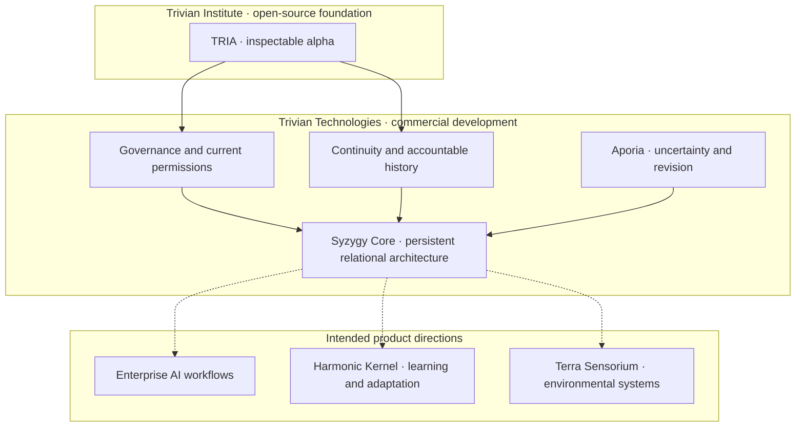

# Trivian Technologies

**Relationship is the Technology.**

We are developing an early architecture for accountable, persistent, multi-agent AI systems. Our first commercial investigation applies that architecture to AI-native financial compliance, beginning with lending.

[Investor overview](https://github.com/TrivianTechnologies/.github/blob/main/docs/investors.md) · [TRIA SDK](https://github.com/TrivianInstitute/tria-sdk) · [Trivian Field](https://trivianfield.com)

## What we are building

Trivian Technologies is translating a broad relational architecture into commercial products. Our first thesis is that financial institutions need a stronger connection between regulatory requirements, internal policies, operational controls, automated actions, and the evidence showing what happened.

Rosetta is the proposed runtime enforcement and evidence layer within that larger system. Customer discovery will determine which compliance workflow should become the first complete product.

## First vertical: AI-native financial compliance

Consider a lending institution responding to a regulatory change. Its teams must decide whether the change applies, identify affected policies and systems, implement and test the required controls, monitor their operation, and later show an auditor or examiner what occurred.

Our long-term product thesis connects that chain:

**Regulatory change → obligation → policy → control → runtime enforcement → evidence**

Lending is our first discovery wedge because it combines regulated decisions, automated workflows, multiple stakeholders, and strong evidence requirements. We are testing the wedge before committing to a broad compliance platform.

## Evidence and maturity

| Stage | What it includes | Current status |
|---|---|---|
| **Working alpha** | The open-source TRIA SDK and initial Rosetta capabilities for executable policy, action-time decisions, escalation, and audit records. | Publicly inspectable alpha. Production readiness and full-stack validation are not claimed. |
| **Internal demonstration** | One end-to-end lending compliance workflow using representative or sanitized materials. | The next prototype target. No completed integrated financial-compliance product is claimed. |
| **Product direction** | Obligation mapping, policy-to-control mapping, monitoring, evidence review, and the broader persistent-intelligence architecture. | Proposed direction guiding discovery and development. |
| **External validation** | Workflow fit, accuracy, integration effort, operating cost, review burden, security requirements, and willingness to pay. | Not yet established. Capital and design partnerships fund this work. |

The investment opportunity is to fund the transition from an inspectable architecture to a tested commercial system while the category is still taking shape.

## Design partners

We are seeking **3–5 design partners** among community and regional banks, credit unions, fintech lenders, and lending platforms.

The likely executive sponsor is a Chief Compliance Officer, Chief Risk Officer, or lending leader. The working group may include lending compliance, operations, internal audit, engineering, and model-risk teams.

A design partner would help us reconstruct one recurring workflow, test a lightweight prototype, define approval and security requirements, and measure whether Trivian reduces manual coordination or evidence-gathering work. The first candidate workflows are:

- Continuous evidence and auditability for lending controls.
- Moving a regulatory change through affected obligations, policies, controls, implementation, and verification.

## The ecosystem at a glance

The Institute stewards TRIA as an open-source foundation available under MPL-2.0. Technologies develops commercial architecture and products around that publicly available foundation.

*Conceptual architecture, not a deployment map. Integration, testing, and validation remain development work; dashed arrows indicate intended product directions. The capability table below describes the broader stack.*

## The architecture

These are complementary parts of the broader architecture. Their implementation maturity varies; integration and evaluation are active development needs.

| Capability | Purpose |
|---|---|
| **Relational Constants** | Reciprocity, Embodiment, Emergence, and Non-Domination provide principles for designing and evaluating interactions. |
| **Governance and execution boundaries** | Evaluate represented consent and permissions at the point of action. |
| **Coheronmetry** | Represent relational state and examine drift, repair, and sovereignty through proposed measurements. |
| **Orthogonal Signal** | Preserve distinct perspectives and meaningful dissent in multi-agent interaction. |
| **Resonance Lattice** | Coordinate signals and interactions across distributed agents with explicit protocol boundaries. |
| **Diachronic sovereignty** | Preserve accountable history while allowing permissions, commitments, and participation to change. |
| **Aporia** | Give uncertainty and counterevidence a structured role in reopening conclusions. |
| **Syzygy Core** | Compose governance, continuity, revision, and differentiated cognition into a persistent relational architecture. |

## From architecture to products

Our first commercial investigation is AI-native financial compliance. A mature product could connect regulatory requirements with obligations, internal policies, operational controls, runtime decisions, and evidence. Rosetta would serve as the enforcement and evidence engine where automated or AI-driven activity occurs.

Lending is the first discovery wedge. Customer interviews and design partnerships will determine whether the initial MVP focuses on continuous evidence for lending controls or on moving regulatory changes through control implementation and verification.

The broader product direction includes **Syzygy Core** for persistent enterprise and human-AI workflows, **Harmonic Kernel** for learning, coaching, and adaptive interaction, and **Terra Sensorium** for environmental and operational systems. These remain staged directions informed by evaluation and partner needs.

## Technologies and the Institute

**Trivian Institute stewards the open-source foundation, research, and education. Trivian Technologies is a separate commercial venture developing software, applications, and services around that publicly available foundation.**

The Institute's [TRIA SDK](https://github.com/TrivianInstitute/tria-sdk) is an inspectable open-source alpha published under MPL-2.0. It provides a starting point for technical exploration and development.

Each repository's license governs its contents. The SDK's open-source license does not imply that every component in the broader commercial architecture has the same license.

## Current stage

We are at the architecture-to-validation stage. The intellectual foundation and initial TRIA implementation exist. The next work is customer discovery, a focused internal demonstration, rigorous testing, design partnerships, and one end-to-end MVP.

The [investor overview](https://github.com/TrivianTechnologies/.github/blob/main/docs/investors.md) describes the proposed raise, use of funds, and validation milestones.

## Explore and connect

- **Technical foundation:** [TRIA SDK](https://github.com/TrivianInstitute/tria-sdk) and [Trivian Institute repositories](https://github.com/TrivianInstitute)
- **Investment and development partnerships:** [invest@triviantech.com](mailto:invest@triviantech.com)
- **Commercial inquiries:** [se@triviantech.com](mailto:se@triviantech.com)
- **Websites:** [Trivian Technologies](https://triviantech.com) · [Trivian Field](https://trivianfield.com)
- **Founder:** Sarasha Elion, Relational AI Architect, Educator, and Author · [ORCID](https://orcid.org/0009-0005-5819-7082)

**Act. Adapt. Persist.**
