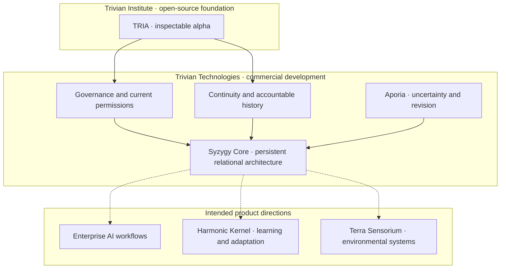

# Trivian Technologies

**Relationship is the Technology.**

Developing software and infrastructure for human–AI collaboration, persistent intelligence, and accountable multi-agent systems around TRIA, the open-source foundation stewarded by [Trivian Institute](https://github.com/TrivianInstitute).

[Investor overview](https://github.com/TrivianTechnologies/.github/blob/main/docs/investors.md) · [TRIA SDK](https://github.com/TrivianInstitute/tria-sdk) · [Trivian Field](https://trivianfield.com)

## What we are building

Intelligence that works with people over time needs to navigate changing permissions, new evidence, evolving commitments, and disagreement. It must preserve an accountable history while remaining able to change.

Trivian Technologies is developing commercial software, applications, integrations, and services around that challenge. Our architecture brings together governance, continuity, evidence-sensitive revision, and independent judgment.

Our thesis is that these capabilities will become foundational as organizations entrust AI with ongoing work.

## The ecosystem at a glance

The Institute stewards TRIA as an open-source foundation available under MPL-2.0. Technologies develops commercial architecture and products around that publicly available foundation.

*Conceptual architecture, not a deployment map. Integration, testing, and validation remain development work; dashed arrows indicate intended product directions. The capability table below describes the broader stack.*

## The architecture

These are complementary parts of the broader architecture. Their implementation maturity varies; integration and evaluation are active development needs.

| Capability | Purpose |
|---|---|
| **Relational Constants** | Reciprocity, Embodiment, Emergence, and Non-Domination provide principles for designing and evaluating interactions. |
| **Governance and execution boundaries** | Evaluate represented consent and permissions at the point of action. |
| **Coheronmetry** | Represent relational state and examine drift, repair, and sovereignty through proposed measurements. |
| **Orthogonal Signal** | Preserve distinct perspectives and meaningful dissent in multi-agent interaction. |
| **Resonance Lattice** | Coordinate signals and interactions across distributed agents with explicit protocol boundaries. |
| **Diachronic sovereignty** | Preserve accountable history while allowing permissions, commitments, and participation to change. |
| **Aporia** | Give uncertainty and counterevidence a structured role in reopening conclusions. |
| **Syzygy Core** | Compose governance, continuity, revision, and differentiated cognition into a persistent relational architecture. |

## From architecture to products

Our proposed first commercial offering supports governed enterprise AI workflows through integrations, decision records, permission handling, continuity, and an operational interface.

Financial and document-intensive professional workflows are initial candidate applications. Audit receipts and decision traceability are part of this direction, within a broader architecture for ongoing collaboration.

The longer-term product direction includes **Syzygy Core** for persistent enterprise and human–AI workflows, **Harmonic Kernel** for learning, coaching, and adaptive interaction, and **Terra Sensorium** for environmental and operational systems. Development will proceed in stages, informed by evaluation and partner needs.

## Technologies and the Institute

**Trivian Institute stewards the open-source foundation, research, and education. Trivian Technologies is a separate commercial venture developing software, applications, and services around that publicly available foundation.**

The Institute's [TRIA SDK](https://github.com/TrivianInstitute/tria-sdk) is an inspectable open-source alpha published under MPL-2.0. It provides a starting point for technical exploration and development.

Each repository's license governs its contents. The SDK's open-source license does not imply that every component in the broader commercial architecture has the same license.

## Current stage

The intellectual foundation and initial TRIA implementation exist. Further engineering, integration, bug resolution, rigorous testing, and early deployments are the next development priorities.

Existing code and tests do not establish production readiness for the full commercial stack. We are seeking capital and development partnerships to fund that work.

The [investor overview](https://github.com/TrivianTechnologies/.github/blob/main/docs/investors.md) describes the proposed raise, use of funds, and development milestones.

## Explore and connect

- **Technical foundation:** [TRIA SDK](https://github.com/TrivianInstitute/tria-sdk) and [Trivian Institute repositories](https://github.com/TrivianInstitute)
- **Investment and development partnerships:** [invest@triviantech.com](mailto:invest@triviantech.com)
- **Commercial inquiries:** [se@triviantech.com](mailto:se@triviantech.com)
- **Websites:** [Trivian Technologies](https://triviantech.com) · [Trivian Field](https://trivianfield.com)
- **Founder:** Sarasha Elion, Relational AI Architect, Educator, and Author · [ORCID](https://orcid.org/0009-0005-5819-7082)

**Act. Adapt. Persist.**
