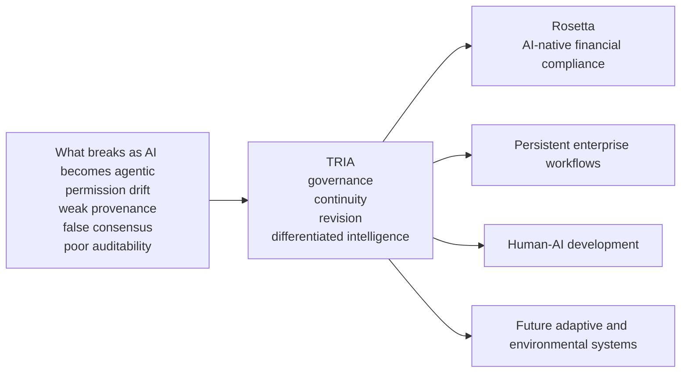

# Trivian Technologies

**Relationship is the Technology.**

## AI is learning to act. The infrastructure around it has not caught up.

The first generation of generative AI answered questions. The next is being asked to **do things**: coordinate across systems, execute workflows, remember prior decisions, work with other agents, and operate with increasing independence over time.

That creates a different class of failure.

Permissions change while agents keep acting from yesterday's authority. One bad assumption spreads through a multi-agent workflow and begins to look like consensus. Decisions become detached from their evidence. New information arrives, but old conclusions remain embedded in memory and process. Humans are left supervising consequences after they have already propagated.

**Trivian Technologies is building TRIA — the Trivian Relational Intelligence Architecture — for that gap.**

TRIA is an architecture for collective intelligence: helping humans and machine systems work together over time while preserving authority, provenance, difference, uncertainty, and the ability to revise.

[Investor overview](https://github.com/TrivianTechnologies/.github/blob/main/docs/investors.md) · [TRIA SDK](https://github.com/TrivianInstitute/tria-sdk) · [Trivian Field](https://trivianfield.com)

---

## The opportunity

The goal is not one intelligence becoming more powerful at the center.

It is a system in which multiple intelligences can remain distinct, challenge one another, change their minds, preserve appropriate authority, and become more capable together.

A mature TRIA deployment is intended to make questions like these continuously answerable:

- Who is authorized to act right now?
- What evidence produced this conclusion?
- Where is there genuine disagreement?
- What changed since the last decision?
- What would cause the system to reconsider?
- When should an action proceed, pause, escalate, or stop?

---

## What exists today

**TRIA Core — open foundation**  
The public relational substrate for governance, provenance, continuity, differentiated signal, sovereignty, and accountable interaction. Stewarded by Trivian Institute and available as an open-source alpha.

**Rosetta — first commercial vertical**  
A working private governance MVP with policy packs, semantic checks, guarded enforcement, escalation, runtime decisions, and audit records. Our first commercial investigation applies Rosetta to AI-native financial compliance, beginning with lending.

**Syzygy Core — differentiated cognition**  
Private R&D for persistent intelligence: signal circulation, lineage preservation, bounded recursive processing, constraint inheritance, dissent preservation, and higher-order synthesis.

**Aporia — uncertainty and revision**  
An executable experimental protocol that preserves competing interpretations, contradiction, confidence, and the conditions under which a conclusion should remain open or be revised.

**Evolution Catalyst — long-term human-AI relationship**  
A deployable experimental alpha exploring consent-governed human development with human-authored objectives, attributable memory, revisable practice, and explicit authority boundaries.

**Implemented does not mean validated. Experimental does not mean imaginary.**

---

## One architecture. Two tracks. Built in parallel.

### Commercial proof

Rosetta gives us a focused entry into a high-accountability market where the problem already exists and the outcomes can be measured.

Our first wedge is financial compliance:

**Regulation → obligation → policy → control → AI action → evidence**

The near-term question is concrete:

**Can TRIA make consequential AI workflows more governable, traceable, revisable, and economically useful?**

### Full-stack TRIA

At the same time, we are integrating the deeper architecture required for persistent collective intelligence.

TRIA provides the relational foundation. Rosetta governs consequential action. Aporia protects the boundary between evidence and interpretation. Syzygy Core coordinates differentiated cognition across time. Additional layers extend that architecture into learning, human development, adaptive systems, and future environmental applications.

The commercial vertical gives the architecture somewhere real to prove itself.

The full stack ensures the company is not limited to a single workflow or industry.

---

## Why invest now

**Proposed pre-seed target: $2 million.**

The architecture is already taking form. The raise funds the crossing from **architecture to evidence**:

- integrate the existing components into one deployable system;
- build and test the first end-to-end commercial workflow;
- recruit design partners and convert validated deployments into recurring customers;
- conduct adversarial, security, and independent technical evaluation;
- harden the infrastructure required for real organizational use;
- establish the corporate and IP foundation required to scale.

The larger bet is this:

**As intelligence becomes distributed across humans and machines, can TRIA become part of the infrastructure through which that intelligence works together?**

That is the company we are building.

---

## Explore and connect

- **TRIA open-source foundation:** [TRIA SDK](https://github.com/TrivianInstitute/tria-sdk)
- **Investor overview:** [Trivian Technologies investor brief](https://github.com/TrivianTechnologies/.github/blob/main/docs/investors.md)
- **Research and public repositories:** [Trivian Institute](https://github.com/TrivianInstitute)
- **Investment and development partnerships:** [invest@triviantech.com](mailto:invest@triviantech.com)
- **Commercial inquiries:** [node@triviantech.com](mailto:node@triviantech.com)
- **Websites:** [Trivian Technologies](https://triviantech.com) · [Trivian Field](https://trivianfield.com)
- **Founder:** Sarasha Elion, Relational AI Architect, Educator, and Author · [ORCID](https://orcid.org/0009-0005-5819-7082)

**Act. Adapt. Persist.**
